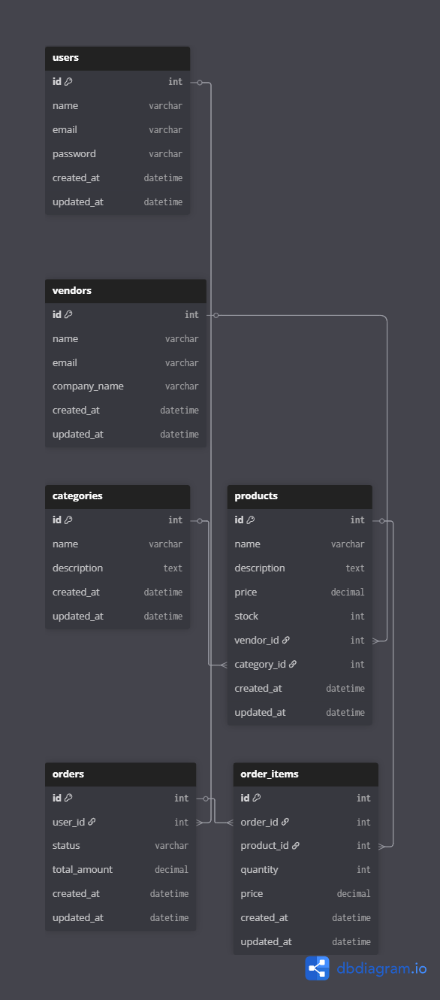

# Backend E-commerce API

A robust Node.js/Express backend API for an e-commerce platform with authentication, authorization, and database integration.

## Project Structure

```
backend-ecommerce-api/
├── src/
│   ├── config/              # Configuration files (database, JWT, etc.)
│   ├── controllers/         # Route handlers/business logic
│   ├── middleware/          # Custom middleware (auth, validation, error handling)
│   ├── models/              # Database schemas/models
│   ├── routes/              # API route definitions
│   ├── services/            # Business logic layer
│   ├── utils/               # Helper functions & utilities
│   └── app.js               # Express app setup
├── server.js                # Entry point
├── .env                     # Environment variables (create this)
├── .gitignore               # Git ignore rules
├── package.json             # Project dependencies
└── README.md                # This file
```
## ER Diagram
This diagram shows the relationships between Users, Vendors, Products, Orders, and Categories.



## Installation

1. Install dependencies:
```bash
npm install
```

2. Create a `.env` file in the root directory:
```bash
cp .env .env.local
```

3. Update `.env` with your configuration values:
   - `MONGODB_URI`: Your MongoDB connection string
   - `JWT_SECRET`: Your JWT secret key
   - `PORT`: Server port (default: 5000)

## Running the Project

### Development Mode (with auto-reload)
```bash
npm run dev
```

### Production Mode
```bash
npm start
```

## Available Scripts

- `npm start` - Start production server
- `npm run dev` - Start development server with nodemon
- `npm test` - Run tests

## Features

✓ Express.js server setup with middleware
✓ MongoDB database integration
✓ JWT-based authentication
✓ Role-based authorization (customer, vendor, admin)
✓ CORS enabled for cross-origin requests
✓ Security headers with Helmet.js
✓ Request logging with Morgan
✓ Input validation with express-validator
✓ Global error handling
✓ Environment configuration with dotenv
✓ Swagger API documentation

## API Endpoints

## API Documentation (Swagger)

Swagger UI is available at: 
Check API docs at localhost:5000/api-docs
> Note: This URL works only when the backend is running on your machine.

Use Swagger UI to:
- View all API endpoints
- Test APIs directly from the browser
- Check request/response formats

### Health Check
- `GET /api/health` - Check if API is running

### Authentication (To be implemented)
- `POST /api/auth/register` - User registration
- `POST /api/auth/login` - User login
- `POST /api/auth/refresh` - Refresh JWT token
- `POST /api/auth/logout` - User logout

### Users (To be implemented)
- `GET /api/users` - Get all users
- `GET /api/users/:id` - Get user by ID
- `PUT /api/users/:id` - Update user
- `DELETE /api/users/:id` - Delete user

### Products (To be implemented)
- `GET /api/products` - Get all products
- `GET /api/products/:id` - Get product by ID
- `POST /api/products` - Create product (vendor only)
- `PUT /api/products/:id` - Update product (vendor only)
- `DELETE /api/products/:id` - Delete product (vendor only)

### Orders (To be implemented)
- `GET /api/orders` - Get user orders
- `POST /api/orders` - Create order
- `GET /api/orders/:id` - Get order details
- `PUT /api/orders/:id` - Update order status (admin/vendor)

## Middleware
- Helmet – Security headers
- CORS – Cross-origin request handling
- Morgan – HTTP request logging
- authenticate – JWT authentication
- authorize – Role-based access control
- Swagger – API documentation
- errorHandler – Global error handling

### Security
- **Helmet.js** - Sets HTTP security headers
- **CORS** - Enables cross-origin requests

### Authentication
- **authenticate()** - Verifies JWT token
- **authorize(...roles)** - Checks user permissions

### Validation
- **handleValidationErrors()** - Processes validation errors

### Error Handling
- **errorHandler** - Global error handler (catches all errors)
- **asyncHandler** - Wraps async route handlers

## Environment Variables

Create a `.env` file with:

```env
# Server
PORT=5000
NODE_ENV=development

# Database
MONGODB_URI=mongodb://localhost:27017/ecommerce-db

# JWT
JWT_SECRET=your_secret_key
JWT_EXPIRE=15m

# OAuth
GOOGLE_CLIENT_ID=your_id
GOOGLE_CLIENT_SECRET=your_secret

# URLs
API_URL=http://localhost:5000
FRONTEND_URL=http://localhost:3000
```

## Next Steps
- ✓ Project structure setup
- ✓ ER diagram & schema design
- ✓ Swagger API documentation
- ✓ Express middleware & auth setup
- Implement remaining APIs
- Add validation and testing


## Technologies Used
- **Node.js** – Server-side JavaScript runtime  
- **Express.js** – Framework for RESTful APIs  
- **MongoDB** – NoSQL database  
- **Mongoose** – MongoDB schema modeling  
- **JWT** – Authentication & authorization  
- **bcryptjs** – Password hashing  
- **Swagger (OpenAPI 3.0)** – API documentation  
- **swagger-jsdoc** – Swagger specs from JSDoc  
- **swagger-ui-express** – Interactive API UI  
- **Helmet.js** – Security headers  
- **CORS** – Cross-origin requests  
- **Morgan** – HTTP request logging  
- **dotenv** – Environment variable management  
- **Nodemon** – Auto-reload dev server 

## License

ISC

## Author

Team B - Backend
